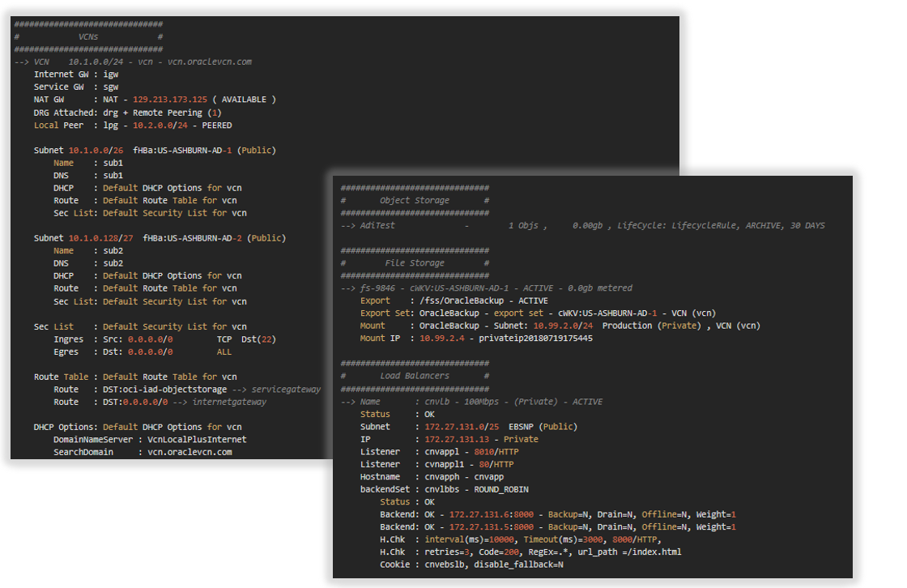
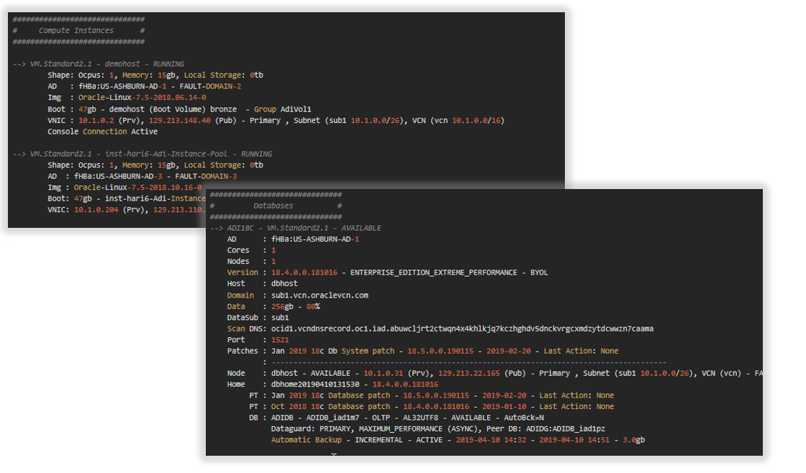

## showoci_compact - Oracle Cloud Infrastructure Compact Reporting Tool

SHOWOCI Compact is a reporting tool which uses the Python SDK to extract list of resources from your tenant. 
It covers 5 OCI Resources,  
Authentication by User or Compute using instance principals, 
Output is printer friendly, or JSON

**DISCLAIMER – This is not an official Oracle application,  It should NOT be used for utilization calculation purposes, and rather OCI's official 
[cost analysis](https://docs.oracle.com/en-us/iaas/Content/Billing/Concepts/costanalysisoverview.htm) 
and [usage reports](https://docs.oracle.com/en-us/iaas/Content/Billing/Concepts/usagereportsoverview.htm) features should be used instead.**

Full showoci version moved to [external github account](https://github.com/adizohar/showoci)

**Developed by Adi Zohar, 2018-2021**




## Modules Included:  
- oci.core.VirtualNetworkClient          
- oci.core.ComputeClient                 
- oci.core.BlockstorageClient            
- oci.database.DatabaseClient            
- oci.identity.IdentityClient            

## Executing using Cloud Shell:
```
1. install oci sdk package
   pip3 install --user oci

2. clone the oci sdk repo
   git clone https://github.com/oracle/oci-python-sdk

3. run showoci with delegation token
   cd oci-python-sdk/examples/showoci_compact
   python3 showocic.py -dt -ani
```

## OCI Authentication using Instance Principals 

Create Dynamic Group ShowOCIDynamicGroup:
```
any {ALL {instance.id = 'ocid1.instance.oc1.xxxxxxxxxx'}}
```

Add Policy:
```
allow dynamic-group ShowOCIDynamicGroup to read all-resources in tenancy
```

## OCI Authentication using Read Only User
Required OCI IAM user with read only privileges

```
ALLOW GROUP ReadOnlyUsers to read all-resources IN TENANCY
```

For restrictive privileges:

```
Allow group ReadOnlyUsers to inspect all-objects in tenancy
Allow group ReadOnlyUsers to read instances      in tenancy
Allow Group ReadOnlyUsers to read network-security-groups in tenancy

```

## Installation of Python 3 incase you don't have Python3 installed:
Please follow [Python Documentation](https://docs.python.org/3/using/index.html)

## Install oci SDK Packages:
Please follow [Oracle Python SDK Documentation](https://github.com/oracle/oci-python-sdk)

## Setup connectivity using Instance Principals

```  
1. Login to your OCI Cloud console
2. Create new Dynamic Group : ShowOCIDynamicGroup  
   Obtain Compute OCID and add rule - any {ALL {instance.id = 'ocid1.instance.oc1.xxxxxxxxxx'}}
3. Create new Policy: ShowOCIDynamicGroupPolicy with Statement - allow dynamic-group ShowOCIDynamicGroup to read all-resources in tenancy
```

## Setup connectivity using Read Only User

```  
1. Login to your OCI Cloud console
2. Create new group : ReadOnlyGroup  
3. Create new Policy: ReadOnlyGroupPolicy with Statement - ALLOW GROUP ReadOnlyGroup to read all-resources IN TENANCY  
4. Create new User  : readonly.user -> Add to ReadOnlyGroup group  
5. Config OCI config file - ~/.oci/config
   Please follow SDK config documentation - https://docs.cloud.oracle.com/en-us/iaas/Content/API/Concepts/sdkconfig.htm 
```

## Copy the Software
Download the showoci*.py from this project  

Execute  

```
$ ./showocic.py  

usage: showoci.py [-h] [-a] [-ani] [-an] [-api] [-b] [-c] [-cn] [-d] [-e] [-edge] [-f] [-fun] [-i] [-ic] [-isc] [-l] [-lq] [-m] [-n] [-o] [-paas] [-dataai] [-rm] [-s] [-sec]
                  [-nobackups] [-so] [-mc] [-nr] [-ip] [-dt] [-t PROFILE] [-p PROXY] [-rg REGION] [-cp COMPART] [-cpr COMPART_RECUR] [-cpath COMPARTPATH] [-tenantid TENANTID]
                  [-cf CONFIG] [-csv CSV] [-jf JOUTFILE] [-js] [-sjf SJOUTFILE] [-cachef SERVICEFILE] [-caches] [--version]

optional arguments:
  -h, --help           show this help message and exit
  -a                   Print All Resources
  -ani                 Print All Resources but identity
  -an                  Print Announcements
  -api                 Print API Gateways
  -b                   Print Budgets
  -c                   Print Compute
  -cn                  Print Containers
  -d                   Print Database
  -e                   Print EMail
  -edge                Print Edge, DNS Services and WAAS policies
  -f                   Print File Storage
  -fun                 Print Functions
  -i                   Print Identity
  -ic                  Print Identity Compartments only
  -isc                 Skip Identity User Credential extract
  -l                   Print Load Balancer
  -lq                  Print Limits and Quotas
  -m                   Print Monitoring, Notifications and Events
  -n                   Print Network
  -o                   Print Object Storage
  -paas                Print PaaS Platform Services - OIC OAC OCE
  -dataai              Print - D.Science, D.Catalog, D.Flow, ODA and BDS
  -rm                  Print Resource management
  -s                   Print Streams
  -sec                 Print Security and Logging
  -nobackups           Do not process backups
  -so                  Print Summary Only
  -mc                  exclude ManagedCompartmentForPaaS
  -nr                  Not include root compartment
  -ip                  Use Instance Principals for Authentication
  -dt                  Use Delegation Token (Cloud shell)
  -t PROFILE           Config file section to use (tenancy profile)
  -p PROXY             Set Proxy (i.e. www-proxy-server.com:80)
  -rg REGION           Filter by Region
  -cp COMPART          Filter by Compartment Name or OCID
  -cpr COMPART_RECUR   Filter by Comp Name Recursive
  -cpath COMPARTPATH   Filter by Compartment path ,(i.e. -cpath "Adi / Sub"
  -tenantid TENANTID   Override confile file tenancy_id
  -cf CONFIG           Config File (~/.oci/config)
  -csv CSV             Output to CSV files, Input as file header
  -jf JOUTFILE         Output to file (JSON format)
  -js                  Output to screen (JSON format)
  -sjf SJOUTFILE       Output to screen (nice format) and JSON File
  -cachef SERVICEFILE  Output Cache to file (JSON format)
  -caches              Output Cache to screen (JSON format)
  --version            show program's version number and exit

```

## Below example of reports from few tenancies  

```
############################################################
#                  Start Extracting Data                   #
############################################################

############################################################
#                        showoci.py                        #
############################################################
Authentication : Config File
Config File    : ~/.oci/config
Config Profile : adi
Version        : 19.4.2
Date/Time      : 2019-04-03 00:00:04
Comand Line    : -t adi -a
OCI SDK Ver    : 2.2.1

############################################################
#                 Load OCI data to Memory                  #
############################################################
Load Guide - '.' Compartment, '+' VCN, '-' Subnets

Identity...
--> Tenancy                  <--  (1) - 0 sec
--> Compartments             <--  (12) - 0 sec

##############################
#    Region us-ashburn-1     #
##############################
Identity...
--> Availability Domains     <--  (3) - 0 sec

Network...
--> Virtual Cloud Networks   <-- ............ (5) - 1 sec
--> Subnets                  <-- +++++ (54) - 7 sec
--> Service Gateways         <-- ............ (1) - 1 sec
--> NAT Gateways             <-- ............ (0) - 0 sec
--> Dynamic Routing GWs      <-- ............ (3) - 2 sec
--> Dynamic Routing GW Attch <-- ............ (3) - 1 sec
--> Customer Prem Equipments <-- ............ (1) - 1 sec
--> IPSEC tunnels            <-- ............ (0) - 1 sec
--> Remote Peer Conns        <-- ............ (1) - 1 sec
--> Virtual Circuits         <-- ............ (2) - 1 sec
--> Internet Gateways        <-- +++++ (3) - 4 sec
--> Local Peer GWs           <-- +++++ (0) - 5 sec
--> Security Lists           <-- +++++ (61) - 5 sec
--> Network Security Groups  <-- ............ (2) - 1 sec
--> DHCP Options             <-- +++++ (8) - 5 sec
--> Route Tables             <-- +++++ (66) - 6 sec
--> Routed Private IPs       <--  (0) - 0 sec

Compute...
--> Instances                <-- ............ (146) - 21 sec
--> Images                   <-- ............ (33) - 5 sec
--> Boot Volumes Attached    <-- ............ (146) - 5 sec
--> Volumes Attached         <-- ............ (120) - 8 sec
--> Vnics Attached           <-- ............ (146) - 22 sec
--> Instance Configurations  <-- ............ (0) - 1 sec
--> Instance Pools           <-- ............ (0) - 1 sec

Block Storage...
--> Block Volume Groups      <-- ............ (0) - 1 sec
--> Boot Volumes             <-- ............ (157) - 13 sec
--> Boot Volumes Backups     <-- ............ (7) - 1 sec
--> Block Volumes            <-- ............ (164) - 15 sec
--> Block Volumes Backups    <--  (344) - 1 sec

Database...
--> DB Systems               <-- ............ (3) - 17 sec
--> Autonomous Databases     <-- ............ (0) - 4 sec

############################################################
#                  Start Processing Data                   #
############################################################

Extracting Identity
    Tenancy...
    Users...
    Groups...
    Dynamic Groups...
    Policies...
    Providers...

Extracting Region us-ashburn-1
    Compartment gse00015259 (root)...
    Compartment Adi...
    Compartment Adi / Dev...
    Compartment Adi / Dev / DevA...
    Compartment Adi / Dev / DevB...
    Compartment Adi / Prod...
    Compartment NetworkCompartment...


##########################################################################################
#                                        Tenancy                                         #
##########################################################################################
Name        - CUST
OCID        - ocid1.tenancy.oc1..aaaaaaaae5u57gqxs5qas5f33qnge63sdoi7s2ji6bk5slscblmxxxxxxx
Home Region - IAD
Subs Region - us-ashburn-1, us-phoenix-1

##############################
#           Users            #
##############################
--> adi.zohar
    Groups = Administrators 

--> adi_ocicli
    Groups = Administrators 

--> adi_terraform
    Groups = Administrators 

##############################
#           Groups           #
##############################
--> Administrators       : adi.zohar  
--> DBAdmin              : 
--> demousers            : api.user  
--> ObjectAdmins         : pocuser  
--> ReadOnlyUsers        : 


##############################
#       Dynamic Groups       #
##############################
--> AdiDynamicGroup
    Desc      :Description
    Rules     :any {ALL {instance.compartment.id = 'Demo'}}

##############################
#          Policies          #
##############################

Compartment Demo:

--> Demo
    Allow group demousers to manage all-resources in compartment Demo
      Allow service PSM to inspect vcns in compartment Demo
      Allow service PSM to use subnets in compartment Demo
      Allow service PSM to use vnics in compartment Demo
      Allow service PSM to manage security-lists in compartment Demo

Compartment gse00000000 (root):

--> ObjectPolicy:
    Allow group ObjectAdmins to manage buckets in tenancy
    Allow group ObjectAdmins to manage objects in tenancy

--> ReadOnlyPolicy:
    ALLOW GROUP ReadOnlyUsers to read all-resources IN TENANCY

--> Tenant Admin Policy:
    ALLOW GROUP Administrators to manage all-resources IN TENANCY

##############################
#     identity providers     #
##############################
--> OracleIdentityCloudService
    Desc      :Oracle identity cloud service added during account creation
    Type      :IDCS
    Protocol  :SAML2
    Redirect  :https://idcs-7520d863a50f4e9ca469bcxxxxxxxxx.identity.oraclecloud.com/fed/v1/idp/sso
    Metadata  :https://idcs-7520d863a50f4e9ca469bxxxxxxxxxx.identity.oraclecloud.com
    Group Map :DemoUsers <-> demousers
    Group Map :OCI_Administrators <-> Administrators

##############################
#     Cost Tracking Tags     #
##############################
--> Project.Billing
    Desc      :Billing Cost
    Created   :2019-04-03 12:38

##############################
#          Budgets           #
##############################
--> DemoBudget for Compartment: Demo (MONTHLY)
    Costs   : Spent: 0.0, Forcasted: 0.0 , Time Computed: 2019-04-17 17:45
    Created : 2019-04-17 15:57, Total Alert Rules: 0

--> BudgetForAdiCompartment for Compartment: Adi (MONTHLY)
    Costs   : Spent: 0.0, Forcasted: 0.0 , Time Computed: 2019-04-17 17:45
    Created : 2019-04-17 13:29, Total Alert Rules: 2

##########################################################################################
#                                  Region us-ashburn-1                                   #
##########################################################################################

############################################################
#                   Compartment Network                    #
############################################################

##############################
#            VCNs            #
##############################
--> VCN    10.1.0.0/24 - vcn - vcn.oraclevcn.com
    Internet GW : igw
    Service GW  : sgw
    NAT GW      : NAT - 129.213.173.125 ( AVAILABLE )
    DRG Attached: drg + Remote Peering (1)
    Local Peer  : lpg - 10.2.0.0/24 - PEERED

    Subnet 10.1.0.0/26  fHBa:US-ASHBURN-AD-1 (Public)
        Name    : sub1
        DNS     : sub1
        DHCP    : Default DHCP Options for vcn
        Route   : Default Route Table for vcn
        Sec List: Default Security List for vcn

    Subnet 10.1.0.128/27  fHBa:US-ASHBURN-AD-2 (Public)
        Name    : sub2
        DNS     : sub2
        DHCP    : Default DHCP Options for vcn
        Route   : Default Route Table for vcn
        Sec List: Default Security List for vcn

    Sec List    : Default Security List for vcn
        Ingres  : Src: 0.0.0.0/0         TCP  Dst(22)
        Egres   : Dst: 0.0.0.0/0         ALL

    Sec Group   : AdiSecurityGRoup2
        Ingress : NSG: AdiSecurityGRoup1 ALL   

    Sec Group   : AdiSecurityGRoup1
        Ingress : Src: 0.0.0.0/0         TCP   Src(ALL) Dst(22) 
        Ingress : Src: all-iad-services-in-oracle-services-network ALL   
        Egress  : Dst: 0.0.0.0/0         ALL   

    Route Table : Default Route Table for vcn
        Route   : DST:oci-iad-objectstorage --> servicegateway
        Route   : DST:0.0.0.0/0 --> internetgateway

    DHCP Options: Default DHCP Options for vcn
        DomainNameServer : VcnLocalPlusInternet
        SearchDomain     : vcn.oraclevcn.com

--> VCN    10.2.0.0/24 - vcnpeer - vcnpeer.oraclevcn.com
    Service GW  : sgw
    Local Peer  : lpgpeer - 10.1.0.0/24 - PEERED

    Subnet 10.2.0.0/26  fHBa:US-ASHBURN-AD-1 (Public)
        Name    : sub1
        DNS     : sub1
        DHCP    : Default DHCP Options for vcnpeer
        Route   : Default Route Table for vcnpeer
        Sec List: Default Security List for vcnpeer

    Sec List    : Default Security List for vcnpeer
        Ingres  : Src: 0.0.0.0/0         TCP  Dst(22)
        Ingres  : Src: 0.0.0.0/0         ICMP 4,3
        Ingres  : Src: 10.2.0.0/24       ICMP 3
        Egres   : Dst: 0.0.0.0/0         ALL

    DHCP Options: Default DHCP Options for vcnpeer
        DomainNameServer : VcnLocalPlusInternet
        SearchDomain     : vcnpeer.oraclevcn.com

##############################
#            DRGs            #
##############################
--> DRG    drg

##############################
#            CPEs            #
##############################
--> CPE    CUST GR CPE1 - 16.17.18.19
--> CPE    CUST GR CPE2 - 12.13.14.15

##############################
#           IPSec            #
##############################
--> IPSEC  : CUST GR VPN1
    DRG    : CUST Cloud DRG
    CPE    : CUST GR CPE1 - 100.200.100.200
    Tunnel : 16.17.18.19 UP
    Tunnel : 12.13.14.15 UP
    Routes : 0.0.0.0/0

##############################
#       Remote Peering       #
##############################
--> RPC    Name  : AdiRemotePeer
           DRG   : drg
           Status: PEERED
		   Peer  : PhxRemotePeer - us-phoenix-1

############################################################
#                    Compartment Oracle                    #
############################################################

##############################
#     Compute Instances      #
##############################

--> VM.Standard2.1 - demohost - RUNNING
        Shape: Ocpus: 1, Memory: 15gb, Local Storage: 0tb
        AD   : fHBa:US-ASHBURN-AD-1 - FAULT-DOMAIN-2
        Img  : Oracle-Linux-7.5-2018.06.14-0
        Boot : 47gb - demohost (Boot Volume) bronze  - Group AdiVol1
        VNIC : 10.1.0.2 (Prv), 129.213.148.40 (Pub) - Primary , Subnet (sub1 10.1.0.0/26), VCN (vcn 10.1.0.0/16)
        Console Connection Active

--> VM.Standard2.1 - inst-hari6-Adi-Instance-Pool - RUNNING
        Shape: Ocpus: 1, Memory: 15gb, Local Storage: 0tb
        AD   : fHBa:US-ASHBURN-AD-3 - FAULT-DOMAIN-3
        Img  : Oracle-Linux-7.5-2018.10.16-0
        Boot : 47gb - inst-hari6-Adi-Instance-Pool (Boot Volume) 
        VNIC : 10.1.0.204 (Prv), 129.213.110.160 (Pub) - Primary , Subnet (sub3 10.1.0.192/27), VCN (vcn 10.1.0.0/16)
             : SecGrp: AdiSecurityGRoup2, AdiSecurityGRoup1
        Console Connection Active

##############################
#   Compute Custom Images    #
##############################
--> adi_custom_image1 - Oracle Linux - 47gb - Base:  Oracle-Linux-7.4-2018.01.10-0
--> adi_custom_image2 - Oracle Linux - 47gb - Base:  Oracle-Linux-7.4-2018.01.10-0

##############################
#  Block Boot Not Attached   #
##############################
--> 47gb    - BOOTNOTATT (Boot Volume)  - jjZD:US-ASHBURN-AD-3 - 2018-07-09 16:21

##############################
#         Databases          #
##############################
--> ADI18C - VM.Standard2.1 - AVAILABLE
    AD      : fHBa:US-ASHBURN-AD-1
    Cores   : 1
    Nodes   : 1
    Version : 18.4.0.0.181016 - ENTERPRISE_EDITION_EXTREME_PERFORMANCE - BYOL
    Host    : dbhost
    Domain  : sub1.vcn.oraclevcn.com
    Data    : 256gb - 80%
    DataSub : sub1
    Scan DNS: ocid1.vcndnsrecord.oc1.iad.abuwcljrt2ctwqn4x4khlkjq7kczhghdv5dnckvrgcxmdzytdcwwzn7caama
    Port    : 1521
    Patches : Jan 2019 18c Db System patch - 18.5.0.0.190115 - 2019-02-20 - Last Action: None
            : ------------------------------------------------------------------------------------------
    Node    : dbhost - AVAILABLE - 10.1.0.31 (Prv), 129.213.22.165 (Pub) - Primary , Subnet (sub1 10.1.0.0/26), VCN (vcn) - FAULT-DOMAIN-2
    Home    : dbhome20190410131530 - 18.4.0.0.181016
         PT : Jan 2019 18c Database patch - 18.5.0.0.190115 - 2019-02-20 - Last Action: None
         PT : Oct 2018 18c Database patch - 18.4.0.0.181016 - 2019-01-10 - Last Action: None
         DB : ADIDB - ADIDB_iad1m7 - OLTP - AL32UTF8 - AVAILABLE - AutoBck=N
              Dataguard: PRIMARY, MAXIMUM_PERFORMANCE (ASYNC), Peer DB: ADIDG:ADIDB_iad1pz
              Automatic Backup - INCREMENTAL - ACTIVE - 2019-04-10 14:32 - 2019-04-10 14:51 - 3.0gb

--> npappdb - BM.DenseIO1.36 - AVAILABLE
    AD      : iQAs:US-ASHBURN-AD-2
    Cores   : 4
    Version : 12.2.0.1.180116 - ENTERPRISE_EDITION_HIGH_PERFORMANCE - LICENSE_INCLUDED
    Host    : npappdb
    Domain  : dbnp.phxvcn.oraclevcn.com
    Data(gb): None - 80%
    DataSub : 172.27.131.128/26  DBNP (Public)
    Port    : 1521
    Node    : npappdb - AVAILABLE - 172.27.131.130 (Priv), 129.146.127.159 (Pub)  - Primary
    Home 1  : 12.1.0.2             - OraDB12102_home3
            : cnvcdb - cnvcdb - cnvcdbDEFAULTPDB - DSS - US7ASCII - AVAILABLE - AutoBck=N
    Home 2  : 12.1.0.2.180116      - npappdb-dbhome01
            : gldcdb - gldcdb_phx2vp - None - OLTP - AL32UTF8 - AVAILABLE - AutoBck=N
    Home 3  : 12.1.0.2             - OraDB12102_home10
            : qualcdb - qualcdb - qualcdbDEFAULTPDB - OLTP - US7ASCII - AVAILABLE - AutoBck=N

--> npdb - Exadata.Half2.184 - AVAILABLE
    AD      : qFAY:US-ASHBURN-AD-1
    Cores   : 184
    Version : 18.0.0.0.0 - ENTERPRISE_EDITION_EXTREME_PERFORMANCE - BRING_YOUR_OWN_LICENSE
    Host    : dbnp-lg255
    Domain  : db.vnp.oraclevcn.com
    Cluster : crs
    Data(gb): None - 80%
    DataSub : 10.90.2.0/26  db (Private)
    BackSub : 10.90.2.64/26  dbback (Private)
    Scan Ips: 10.90.2.10 - dbnp-lg255-scan-0
    Scan Ips: 10.90.2.11 - dbnp-lg255-scan-1
    Scan Ips: 10.90.2.12 - dbnp-lg255-scan-2
    VIP Ids : 10.90.2.6 - dbnp-lg2551-vip
    VIP Ids : 10.90.2.7 - dbnp-lg2552-vip
    VIP Ids : 10.90.2.8 - dbnp-lg2553-vip
    VIP Ids : 10.90.2.9 - dbnp-lg2554-vip
    Port    : 1521
    Node 1  : dbnp-lg2551 - AVAILABLE - 10.90.2.2 (Priv), None (Pub)  - Primary
    Node 2  : dbnp-lg2553 - AVAILABLE - 10.90.2.4 (Priv), None (Pub)  - Primary
    Node 3  : dbnp-lg2554 - AVAILABLE - 10.90.2.5 (Priv), None (Pub)  - Primary
    Node 4  : dbnp-lg2552 - AVAILABLE - 10.90.2.3 (Priv), None (Pub)  - Primary
    Home 1  : 11.2.0.4 - dbhome20180703145724
            : OADEV - OADEV_iad1g9 - None - OLTP - AL32UTF8 - AVAILABLE - AutoBck=N
    Home 2  : 18.0.0.0 - dbhome20180702145427
            : db18 - db18_iad1z4 - None - OLTP - AL32UTF8 - AVAILABLE - AutoBck=N


##########################################################################################
#                     Completed Successfully at 2019-04-05 08:15:16                      #
##########################################################################################

```
