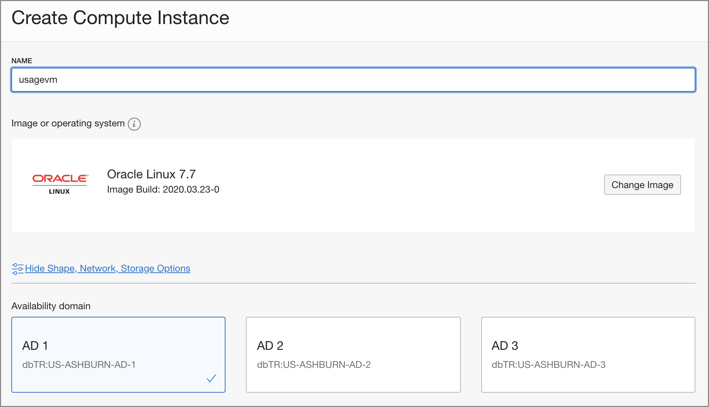
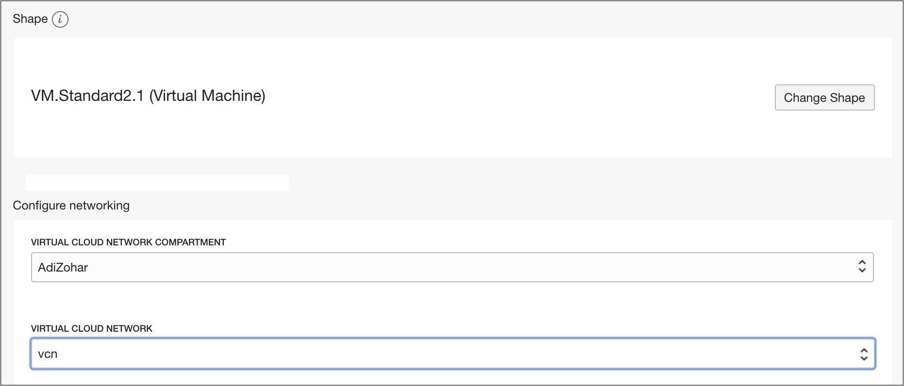
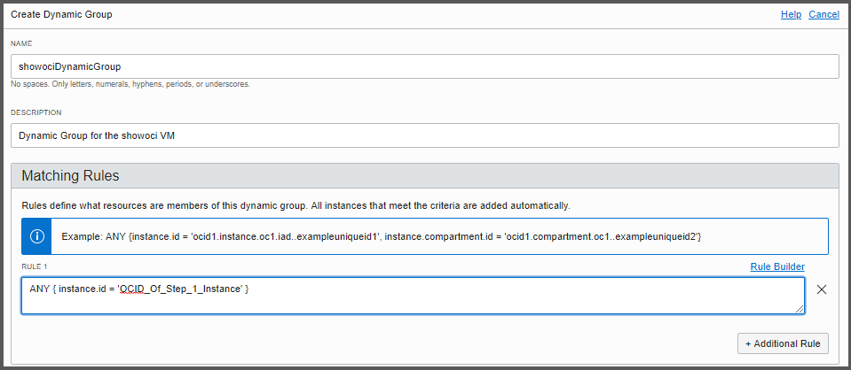
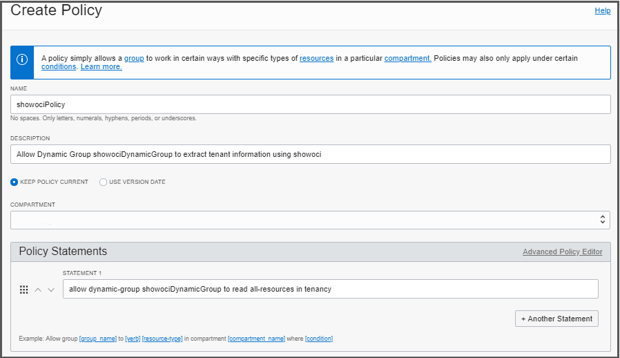

# showoci Compact - Oracle Cloud Infrastructure Compact Reporting Tool

## Step by Step installation Guide on OCI VM
SHOWOCI Compact is a reporting tool which uses the Python SDK to extract list of resources from your tenant. 
It covers 5 of OCI components, 
Authentication by User or Compute using instance principals, 
Output can be printer friendly, CSV files or JSON file.

**Developed by Adi Zohar**

**DISCLAIMER – This is not an official Oracle application**

**It should NOT be used for utilization calculation purposes, and rather OCI's official 
[cost analysis](https://docs.oracle.com/en-us/iaas/Content/Billing/Concepts/costanalysisoverview.htm) 
and [usage reports](https://docs.oracle.com/en-us/iaas/Content/Billing/Concepts/usagereportsoverview.htm) features should be used instead.**

## 1. Deploy VM Compute instance to run the python script
```
   OCI -> Menu -> Compute -> Instances
   Create Instance
   --> Name = ShowOCIVM
   --> Image = Oracle Linux 7
   --> Shape = VM.Standard2.1 (Free Micro can be used as well)
   --> Choose your network VCN and Subnet (any type of VCN and Subnet)
   --> Assign public IP -  Optional if on public subnet
   --> Add your public SSH key
   --> Press Create
```





```
   Copy Instance Info:
   --> Compute OCID to be used for Dynamic Group Permission
   --> Compute IP
```

## 2. Create Dynamic Group for Instance Principles

```
   OCI -> Menu -> Identity -> Dynamic Groups -> Create Dynamic Group
   --> Name = ShowOCIDynamicGroup 
   --> Desc = Dynamic Group for the showoci VM
   --> Rule 1 = ANY { instance.id = 'OCID_Of_Step_1_Instance' }
```


## 3. Create Policy to allow the Dynamic Group to run showoci report

```
   OCI -> Menu -> Identity -> Policies
   Choose Root Compartment
   Create Policy
   --> Name = showociPolicy
   --> Desc = Allow Dynamic Group ShowOCIDynamicGroup to extract tenant information using showoci
   --> Statement = allow dynamic-group ShowOCIDynamicGroup to read all-resources in tenancy
   
```



## 4. Login to Linux Machine

```
   Using the SSH key you provided, SSH to the linux machine from step #1
   ssh opc@UsageVM
```

## 5. Install Python 3, GIT and OCI packages

```
   sudo yum install -y python3 git
   sudo pip3 install --upgrade oci oci-cli 

   # test instance principle is working using oci-cli
   oci os ns get --auth instance_principal
   
   [opc@ShowOCIVM ~]$ oci os ns get --auth instance_principal
   {
       "data": "orasenatdplxxxx"
   }
```

## 6. Clone the OCI SDK Repo from Git Hub

```
   git clone https://github.com/oracle/oci-python-sdk
```

## 7. Execute the python script - showoci.py

```
    cd oci-python-sdk/examples/showoci_compact
    python3 showocic.py -ip -ani
```

## License

Copyright (c) 2016, 2021, Oracle and/or its affiliates.  All rights reserved.
This software is dual-licensed to you under the Universal Permissive License (UPL) 1.0 as shown at https://oss.oracle.com/licenses/upl
or Apache License 2.0 as shown at http://www.apache.org/licenses/LICENSE-2.0. You may choose either license.
